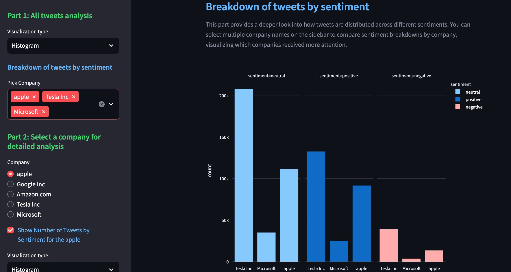

# Dashboard for Sentimental analysis of Tweets about major NASDAQ-listed companies in 2019 year

This project available on https://dashboard-tweets-analysis.streamlit.app/
## Project Overview

This project is an interactive dashboard, that uses a dataset [Tweets about the Top Companies from 2015 to 2020](https://www.kaggle.com/datasets/omermetinn/tweets-about-the-top-companies-from-2015-to-2020/data), featuring tweets related to major NASDAQ-listed companies, that was posted between 01-01-2019 and 31-12-2019. Sentiment analysis was performed using the NLTK library, along with a financial dictionary to better capture the nuances of financial terms. Engagement metrics were computed based on the number of likes, retweets, and comments each tweet received. You can find the preprocessing steps and code on the project’s [GitHub repository](https://github.com/maria-snarava/portfolio-ml).

## Data Source

The dataset used in this project is sourced from Kaggle and contains tweets about top companies from 2015 to 2020 years. It contains over 4 million unique tweets with their information such as tweet ID, author of the tweet, post date, the text body of the tweet, and the number of comments, likes, and retweets of tweets matched with the related company. In my project, I used only 2019's year tweets.

[Tweets about the Top Companies from 2015 to 2020](https://www.kaggle.com/datasets/omermetinn/tweets-about-the-top-companies-from-2015-to-2020/data)

### Key Features
- Number of tweets by company plot (Histogram, pie chart, timeline)
- Engagement plot (Histogram, pie chart, timeline)
- Detailed analysis for a selected company:
- Number of Tweets by Sentiment for selected company (Histogram, pie chart, timeline)
- Number of tweets by sentiment vs stock price for selected company
- Word cloud by sentiment for selected company
- Random tweet about the selected company by sentiment
- Top 5 Most Engaging Tweets about the selected company by sentiment


## Technologies Used

- Python
- Streamlit
- Pandas
- NLTK (for sentiment analysis)
- Plotly Express (for interactive charts)
- Wordcloud and Matplotlib Pyplot for word cloud visualization
- Yfinance

## Screenshots
- 
- 
- 
- 
- 
- 


## Project Structure

```
├── README.md
├── app.py
├── requirements.txt
├── data/
│   └── prepared_data.csv
├── src/
│   ├── data_processing.py
├── img/
│   ├── Screenshots
```

## Future Improvements

- Add cache
- Add more advanced NLP techniques
- Implement real-time tweet fetching
- Enhance UI/UX with more interactive elements

## Contributing

Contributions, issues, and feature requests are welcome. Feel free to check [issues page](https://github.com/maria-snarava/portfolio-ml/issues) if you want to contribute.

## License

This project is licensed under the Creative Commons Attribution-NonCommercial 4.0 International License (CC BY-NC 4.0). This means:

You are free to:

 - Share — copy and redistribute the material in any medium or format
 - Adapt — remix, transform, and build upon the material


Under the following terms:

 - Attribution — You must give appropriate credit, provide a link to the license, and indicate if changes were made.
 - NonCommercial — You may not use the material for commercial purposes.

For more details, please see the full license text.
